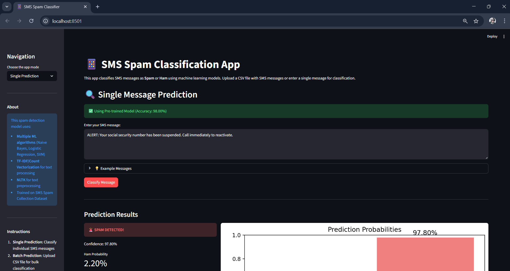
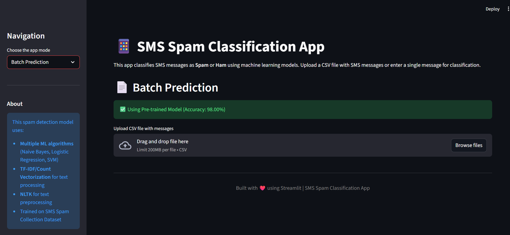
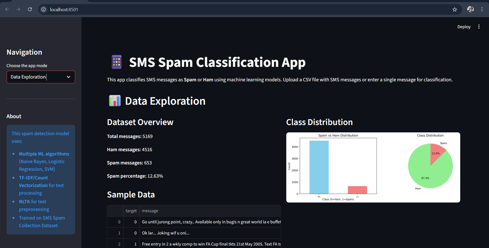
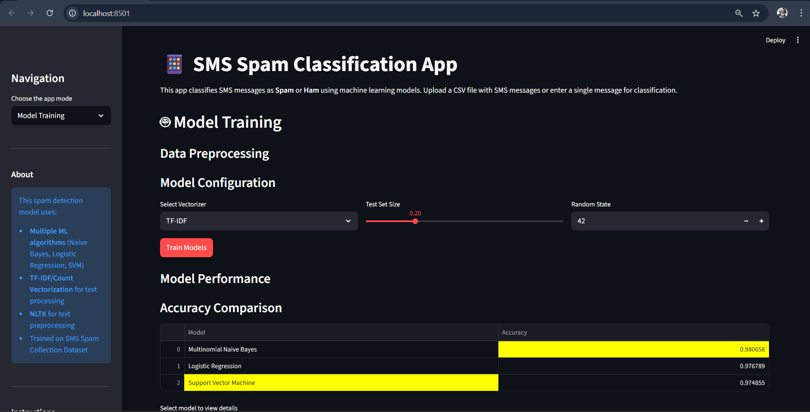

# 📱 SMS Spam Classification System

A comprehensive machine learning application for detecting spam messages in SMS using multiple classification algorithms and an interactive Streamlit web interface.


## 🌟 Features

### 🔍 **Single Message Prediction**
- Real-time classification of individual SMS messages
- Confidence scores for both spam and ham predictions
- Visual probability distribution charts
- Message preprocessing insights

### 📊 **Batch Processing**
- Upload CSV files for bulk message classification
- Download prediction results as CSV
- Comprehensive batch statistics and visualizations
- Support for custom column selection

### 📈 **Data Exploration**
- Interactive dataset visualization
- Class distribution analysis (Pie charts, Bar graphs)
- Message length distribution by class
- Statistical summaries

### 🤖 **Model Training**
- Train multiple ML algorithms simultaneously
- Compare model performance metrics
- Customizable hyperparameters
- Automatic best model selection and persistence

## 🏗️ Project Structure

```
SMS-Spam-Classifier/
├── data/
│   └── sms-spam-collection-dataset/
│       └── spam.csv                    # SMS dataset
├── notebooks/
│   └── Preprocess&EDA&models.ipynb    # Jupyter notebook for EDA
├── models/
│   ├── spam_model.pkl                  # Trained model (generated)
│   └── tfidf_vectorizer.pkl           # Vectorizer (generated)
├── app.py                              # Main Streamlit application
├── requirements.txt                    # Project dependencies
├── Procfile                            # Heroku process file
├── setup.sh                            # Streamlit config for Heroku
├── .slugignore                         # Files to ignore in Heroku slug
└── README.md                           # Project documentation
```

## 📊 Dataset Information

**Source:** SMS Spam Collection Dataset (Kaggle)

| Metric | Value |
|--------|-------|
| Total Messages (Original) | 5,572 |
| Messages After Cleaning | 5,169 |
| Ham Messages | 4,516 (87.37%) |
| Spam Messages | 653 (12.63%) |

## 🛠️ Technical Stack

### Machine Learning
- **Algorithms:** 
  - Multinomial Naive Bayes
  - Logistic Regression
  - Support Vector Machine (SVM)
- **Feature Extraction:** 
  - TF-IDF Vectorization
  - Count Vectorization

### Text Preprocessing
- **NLTK:** Stopword removal, stemming (Porter Stemmer)
- **Regex:** Punctuation and special character removal
- **Custom Pipeline:** Lowercase conversion, tokenization

### Frameworks & Libraries
- **Streamlit:** Interactive web interface
- **scikit-learn:** ML models and evaluation
- **Pandas & NumPy:** Data manipulation
- **Matplotlib & Seaborn:** Visualization

## 🚀 Installation & Setup

### Prerequisites
- Python 3.8 or higher
- pip package manager

### Step 1: Clone the Repository
```bash
git clone https://github.com/JaiswarYash/SPAM-SMS-DETECTION.git
cd SMS-Spam-Classifier
```

### Step 2: Create Virtual Environment
```bash
# Windows
python -m venv venv
venv\Scripts\activate

# macOS/Linux
python3 -m venv venv
source venv/bin/activate
```

### Step 3: Install Dependencies
```bash
pip install -r requirements.txt
```

### Step 4: Download NLTK Data
```python
import nltk
nltk.download('stopwords')
```

### Step 5: Prepare Dataset
Place your `spam.csv` file in the `data/sms-spam-collection-dataset/` directory.

## 💻 Usage

### Running Locally

#### Streamlit Application
```bash
streamlit run app.py
```

The application will open in your default browser at `http://localhost:8501`

#### Using Jupyter Notebook
```bash
jupyter notebook notebooks/Preprocess&EDA&models.ipynb
```

### 🚀 Deployment on Heroku

Deploy your SMS Spam Classifier to Heroku for public access:

#### Prerequisites
- Heroku account (sign up at [heroku.com](https://heroku.com))
- Heroku CLI installed ([installation guide](https://devcenter.heroku.com/articles/heroku-cli))
- Git installed

#### Step 1: Create Required Files

Create a `Procfile` in your project root:
```
web: sh setup.sh && streamlit run app.py
```

Create a `setup.sh` file:
```bash
mkdir -p ~/.streamlit/

echo "\
[general]\n\
email = \"yash.jaiswar0709@gmail.com\"\n\
" > ~/.streamlit/credentials.toml

echo "\
[server]\n\
headless = true\n\
enableCORS=false\n\
port = \$PORT\n\
" > ~/.streamlit/config.toml
```

Update your `requirements.txt` to include all dependencies with specific versions:
```
streamlit==1.28.0
pandas==1.5.3
numpy==1.23.5
scikit-learn==1.3.0
matplotlib==3.7.1
seaborn==0.12.2
nltk==3.8.1
```

#### Step 2: Initialize Git Repository
```bash
git init
git add .
git commit -m "Initial commit for Heroku deployment"
```

#### Step 3: Create Heroku App
```bash
# Login to Heroku
heroku login

# Create a new Heroku app
heroku create your-sms-spam-classifier

# Or use an auto-generated name
heroku create
```

#### Step 4: Configure Buildpacks
```bash
heroku buildpacks:set heroku/python
```

#### Step 5: Deploy to Heroku
```bash
git push heroku main
# or if your branch is master
git push heroku master
```

#### Step 6: Open Your App
```bash
heroku open
```

#### Step 7: Monitor Logs
```bash
heroku logs --tail
```

#### Troubleshooting Heroku Deployment

**Issue: Slug size too large**
```bash
# Check slug size
heroku repo:purge_cache -a your-app-name

# Remove unnecessary files by adding to .slugignore
echo "*.ipynb" >> .slugignore
echo "notebooks/" >> .slugignore
echo "*.md" >> .slugignore
```

**Issue: Memory exceeded**
- Upgrade to a paid dyno for more resources:
```bash
heroku ps:scale web=1:standard-1x
```

**Issue: NLTK data not found**
- Add NLTK data download to your `app.py` (already included in the provided code)

#### Environment Variables (Optional)
```bash
heroku config:set MODEL_PATH=models/spam_model.pkl
heroku config:set VECTORIZER_PATH=models/tfidf_vectorizer.pkl
```

#### Update Deployed App
```bash
git add .
git commit -m "Update application"
git push heroku main
```

#### Cost Optimization
- Use Heroku's free tier for testing (550-1000 dyno hours/month)
- App sleeps after 30 minutes of inactivity on free tier
- Consider upgrading to Hobby ($7/month) for 24/7 uptime

## 📱 Application Modes

### 1️⃣ Single Prediction
1. Navigate to "Single Prediction" from the sidebar
2. Enter your SMS message in the text area
3. Click "Classify Message"
4. View prediction results with confidence scores

### 2️⃣ Batch Prediction
1. Navigate to "Batch Prediction"
2. Upload a CSV file containing messages
3. Select the column with messages
4. Click "Predict Batch"
5. Download results as CSV

### 3️⃣ Data Exploration
1. Navigate to "Data Exploration"
2. View dataset statistics and distributions
3. Analyze message length patterns
4. Explore class imbalance

### 4️⃣ Model Training
1. Navigate to "Model Training"
2. Configure vectorizer type and test size
3. Click "Train Models"
4. Compare model performances
5. Best model is automatically saved

## 📈 Model Performance

| Model | Accuracy | Precision | Recall | F1-Score |
|-------|----------|-----------|--------|----------|
| Multinomial Naive Bayes | ~97% | High | High | High |
| Logistic Regression | ~96% | High | High | High |
| Support Vector Machine | ~98% | High | High | High |

*Note: Exact metrics may vary based on data split and preprocessing*

## 🔧 Text Preprocessing Pipeline

```python
Input Message → Remove Punctuation → Lowercase Conversion → 
Remove Numbers → Tokenization → Remove Stopwords → 
Stemming → Vectorization → Model Prediction
```

## 📦 Dependencies

```
streamlit>=1.28.0
pandas>=1.5.0
numpy>=1.23.0
scikit-learn>=1.3.0
matplotlib>=3.6.0
seaborn>=0.12.0
nltk>=3.8.0
```

See `requirements.txt` for complete list.

## 🎯 Future Enhancements

- [ ] Deep Learning models (LSTM, BERT)
- [ ] Multi-language support
- [ ] Real-time SMS API integration
- [ ] Mobile application
- [ ] Advanced feature engineering (word embeddings)
- [ ] Model explainability (LIME, SHAP)
- [ ] A/B testing framework
- [ ] Docker containerization
- [ ] CI/CD pipeline with GitHub Actions
- [ ] Deployment to AWS/GCP/Azure
- [ ] PostgreSQL database integration
- [ ] User authentication system
- [ ] API endpoint for third-party integration

## 🤝 Contributing

Contributions are welcome! Please follow these steps:

1. Fork the repository
2. Create a feature branch (`git checkout -b feature/AmazingFeature`)
3. Commit your changes (`git commit -m 'Add some AmazingFeature'`)
4. Push to the branch (`git push origin feature/AmazingFeature`)
5. Open a Pull Request

## 📝 License

This project is licensed under the MIT License - see the [MIT](LICENSE) file for details.

## 👥 Authors

- **Yash Jaiswar** - *Initial work* - [mr-yash-dev](https://github.com/JaiswarYash/SPAM-SMS-DETECTION.git)

## 🙏 Acknowledgments

- SMS Spam Collection Dataset from Kaggle
- Streamlit community for excellent documentation
- scikit-learn developers
- NLTK contributors

## 📧 Contact

For questions or feedback, please reach out:
- Email: your.email@example.com
- GitHub: [@YashJaiswar](https://github.com/JaiswarYash/SPAM-SMS-DETECTION.git)
- LinkedIn: [yashjaiswar](https://www.linkedin.com/in/yash-jaiswar-266849301/)

## 📸 Screenshots

### Single Prediction Interface


### Batch Prediction Results


### Data Exploration Dashboard


### Model Training Comparison


---

**⭐ If you find this project helpful, please consider giving it a star!**